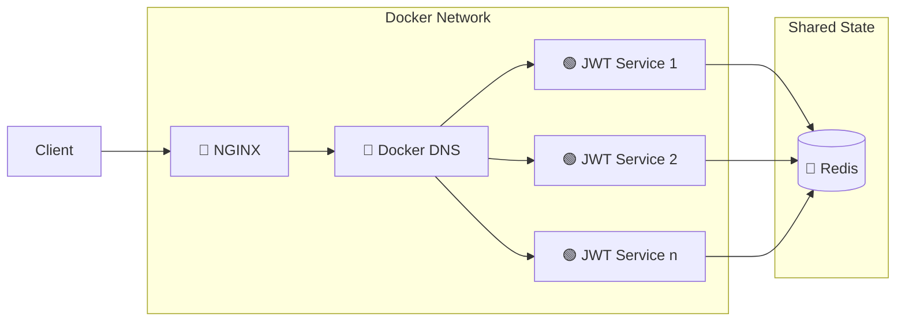

# JWT Microservice &nbsp;  

A high-performance **JWT authentication microservice** written in Go, featuring Redis caching and Docker support.

## 🚀 Features

- 🔐 **JWT-based authentication**
- ⚡ **High-performance Redis caching**
- ♻️ **Token refresh mechanism**
- 🔒 **Auto-logout functionality**
- 📝 **Structured logging**
- 🐳 **Docker support**
- 🌐 **Fast and lightweight**
- 🧪 **Comprehensive test coverage**

## 🛠️ Architecture



## 📚 API Endpoints

| Endpoint        | Method | Description              | Auth Required |
| --------------- | ------ | ------------------------ | ------------- |
| `/ping`         | GET    | Health check endpoint    | ❌ No         |
| `/login`        | POST   | Login and get token pair | ❌ No         |
| `/refresh`      | POST   | Refresh token pair       | ✅ Yes        |
| `/logout`       | POST   | Invalidate token pair    | ✅ Yes        |
| `/authenticate` | GET    | Validate access token    | ✅ Yes        |

## 🚀 Quick Start

### 📋 Prerequisites

- 🐳 **Docker**
- 🛠️ **Docker Compose**

### ⚖️ Scaling

The service supports horizontal scaling through Docker's built-in DNS-based load balancing:

```bash
docker compose up --build --scale jwt=5
```

This command will:

- 🏃‍♂️ Start 5 instances of the JWT service
- 🌐 Register them with Docker's DNS service
- 🔄 Enable automatic load balancing through Docker's embedded DNS server
- 💾 Maintain shared state through Redis

NGINX acts as a reverse proxy, forwarding requests to the Docker DNS service, which routes them to the appropriate JWT service instance.

### 🎯 Running Locally

1. **Clone the repository**

   ```bash
   git clone https://github.com/GregoryKogan/jwt-microservice.git
   cd jwt-microservice
   ```

2. **Choose a startup option:**

#### 🚀 Single Instance

```bash
docker compose up --build
```

#### ⚖️ Multiple Instances (Scaled)

```bash
# Start 5 instances with load balancing
docker compose up --build --scale jwt=5
```

#### 🛠️ Development Mode

```bash
# Live-reloading for single instance
docker compose up --build --watch

# Live-reloading with multiple instances
docker compose up --build --watch --scale jwt=3
```

The service will be available at **`http://localhost:4000`**.

### ⚙️ Configuration

The service is configured via `config.yml`:

```yaml
server:
  port: 8080
  max_processors: 2 # sets GOMAXPROCS

logging:
  mode: text # text or json
  level: debug

cache:
  host: cache
  port: 6379

auth:
  issuer: jwt-microservice
  access_lifetime: 15m
  refresh_lifetime: 720h
  auto_logout: 24h
```

Also, take a look at the `docker-compose.yml` file for more configuration options such as CPU resource limits and port mappings.

### ✅ Testing

Run all tests with cache mocking:

```bash
go test ./... -v
```

## 📊 Load Testing

Load testing is performed using **Grafana K6**. To execute the load tests with the `load-test` profile, run:

```bash
docker compose --profile load-test up --build --scale jwt=5
```

The xk6 dashboard will be available at **`http://localhost:5665`** during load testing.

### 📈 Load Testing Results

| Instances | CPU Limit per Instance | Max Processors | Avg Response Time | RPS  | Error Rate |
| --------- | ---------------------- | -------------- | ----------------- | ---- | ---------- |
| 1         | 0.1                    | 1              | 895.21ms          | 974  | 72.51%     |
| 2         | 0.1                    | 1              | 274.59ms          | 1097 | 53.54%     |
| 4         | 0.2                    | 2              | 8.07ms            | 1163 | 0.39%      |
| 8         | 0.25                   | 2              | 6.7ms             | 1154 | 0.21%      |
| 16        | 0.5                    | 4              | 15.84ms           | 978  | 0.59%      |
| 32        | -                      | -              | 91.54ms           | 1031 | 1.81%      |

> **Note:** Charts and graphs are generated on the fly using **xk6**. Here's an example of the performance chart:


## 🛡️ Security Features

- 🔑 **UUID-based token tracking**
- 🔄 **Token Rotation Mechanism**
- ❌ **Automatic token invalidation**
- ⏰ **Configurable token lifetimes**
- 🔄 **Secure token refresh mechanism**
- 🕒 **Auto-logout for inactive users**

### 🔄 Token Rotation Mechanism

The service implements a secure **token rotation mechanism** to enhance security:

- **Single-Use Refresh Tokens:** Each refresh token is valid for only one use. Upon using it to obtain a new token pair, the old refresh token is invalidated.
- **Prevents Replay Attacks:** This mechanism mitigates the risk of replay attacks by ensuring that stolen or leaked refresh tokens cannot be reused.
- **Seamless User Experience:** Token rotation happens transparently, providing continuous access without requiring the user to re-authenticate.

## 🧩 API Usage Examples

### 🔑 Login

```bash
curl -X POST http://localhost:8080/login \
  -H "Content-Type: application/json" \
  -d '{"user_id": 1}'
```

### ♻️ Refresh Token

```bash
curl -X POST http://localhost:8080/refresh \
  -H "Content-Type: application/json" \
  -d '{"refresh": "your-refresh-token"}'
```

### ✅ Authenticate

```bash
curl -X GET http://localhost:8080/authenticate \
  -H "Authorization: Bearer your-access-token"
```

### 🚪 Logout

```bash
curl -X POST http://localhost:8080/logout \
  -H "Authorization: Bearer your-access-token"
```

## 🤝 Contributing

1. **Fork the repository**
2. **Create your feature branch** (`git checkout -b feature/amazing-feature`)
3. **Commit your changes** (`git commit -m 'Add amazing feature'`)
4. **Push to the branch** (`git push origin feature/amazing-feature`)
5. **Open a Pull Request**

## 📄 License

This project is licensed under the **MIT License** - see the [LICENSE](LICENSE) file for details.
