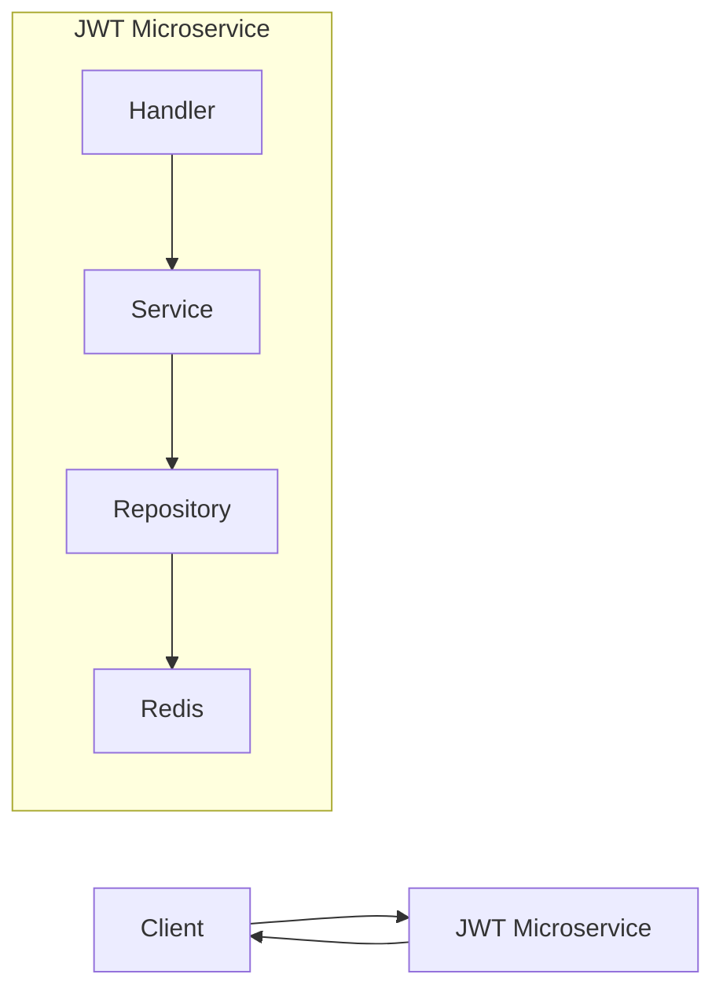

# JWT Microservice

A high-performance JWT authentication microservice written in Go, featuring Redis caching and Docker support.

## Features

- 🔐 JWT-based authentication
- 🚀 High-performance Redis caching
- 🔄 Token refresh mechanism
- 🔒 Auto-logout functionality
- 📝 Structured logging
- 🐳 Docker support
- ⚡ Fast and lightweight
- 🧪 Comprehensive test coverage

## Architecture



## API Endpoints

| Endpoint        | Method | Description              | Auth Required |
| --------------- | ------ | ------------------------ | ------------- |
| `/ping`         | GET    | Health check endpoint    | No            |
| `/login`        | POST   | Login and get token pair | No            |
| `/refresh`      | POST   | Refresh token pair       | No            |
| `/logout`       | POST   | Invalidate token pair    | Yes           |
| `/authenticate` | GET    | Validate access token    | Yes           |

## Quick Start

### Prerequisites

- Go 1.21+
- Docker
- Docker Compose

### Running Locally

1. Clone the repository

```bash
git clone https://github.com/yourusername/jwt-microservice.git
cd jwt-microservice
```

2. Start the service

```bash
docker compose --build up
```

#### Development Mode

To enable live-reloading, run the following command:

```bash
docker compose --build up --watch
```

### Configuration

The service is configured via `config.yml`:

```yaml
server:
  port: 8080

logging:
  mode: text # text or json
  level: debug

cache:
  host: cache
  port: 6379

auth:
  issuer: jwt-microservice
  access_lifetime: 15m
  refresh_lifetime: 720h
  auto_logout: 24h
```

### Testing

Run all tests with cache mocking:

```bash
go test ./... -v
```

## API Usage Examples

### Login

```bash
curl -X POST http://localhost:8080/login \
  -H "Content-Type: application/json" \
  -d '{"user_id": 1}'
```

### Refresh Token

```bash
curl -X POST http://localhost:8080/refresh \
  -H "Content-Type: application/json" \
  -d '{"refresh": "your-refresh-token"}'
```

### Authenticate

```bash
curl -X GET http://localhost:8080/authenticate \
  -H "Authorization: Bearer your-access-token"
```

### Logout

```bash
curl -X POST http://localhost:8080/logout \
  -H "Authorization: Bearer your-access-token"
```

## Security Features

- UUID-based token tracking
- Automatic token invalidation
- Configurable token lifetimes
- Secure token refresh mechanism
- Auto-logout for inactive users

## Contributing

1. Fork the repository
2. Create your feature branch (`git checkout -b feature/amazing-feature`)
3. Commit your changes (`git commit -m 'Add amazing feature'`)
4. Push to the branch (`git push origin feature/amazing-feature`)
5. Open a Pull Request

## License

This project is licensed under the MIT License - see the [LICENSE](LICENSE) file for details.
